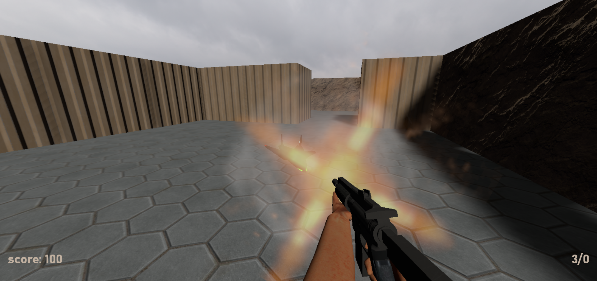
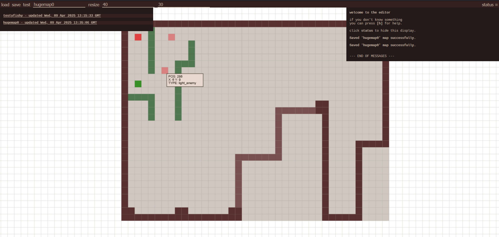

# Drone Scrapper

## ThreeJS FPS similar to Wolf3D




## Running

```bash
cd ds-kotlin-fps-server
./gradlew bootRun
```

## Features

- fully editable maps
- multiple maps stored on server
- more realistic ammo handling (discards whole mag)
- showcase of my modeling skills from 2021

## Modding client

### JavaScript:

1. make changes to JS source code
2. `npm run build` to create dist files
3. copy files from `dist` to server: `src/main/resources/static`

### HTML

mustache templates are stored on server: `src/main/resources/templates`
